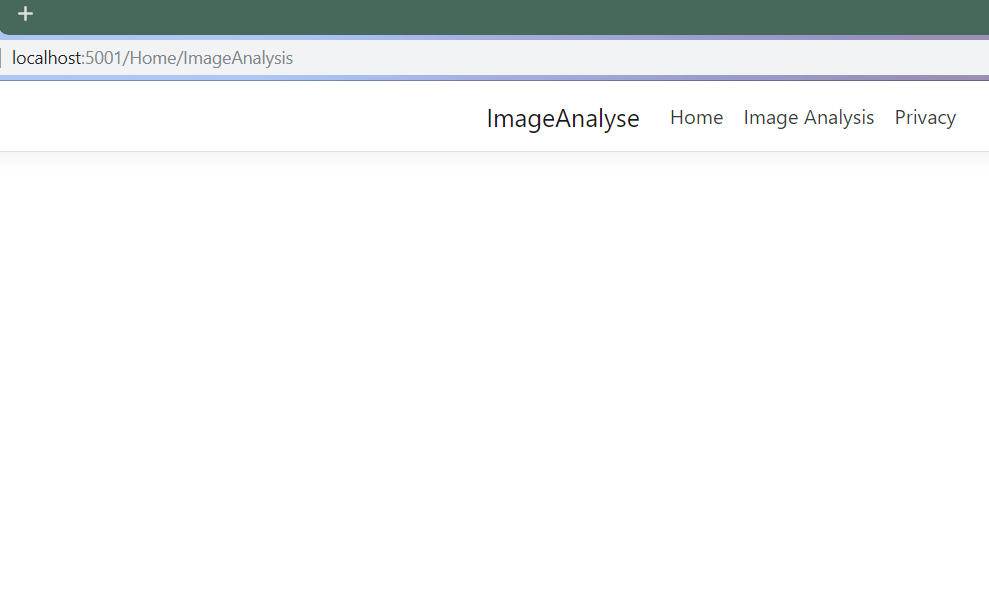
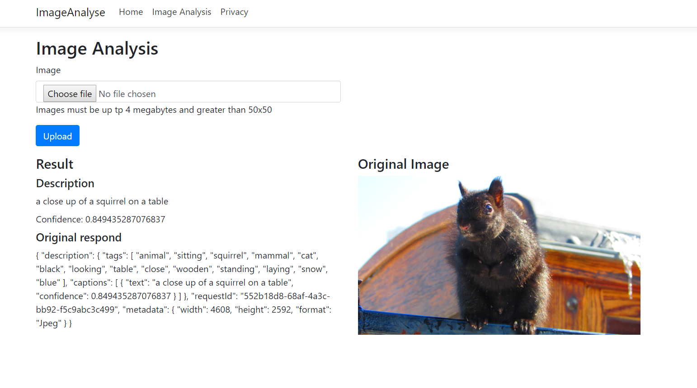

# Creating ASP.NET Core

## Activity Steps
1. Add code to appsettings.json just before ending brackets

``` csharp
  "AppSettings": {
    "VisionApiKey": "",
    "VisionApiEndpoint": ""
  }
```

2. Update your VisionApiKey and VisionApiEndpoint of Computer Vision data from Azure

3. Create new file in folder Models called AppSettings.cs

```AppSettings.cs```

4. Add folowind properties into the new AppSettings.cs file

``` csharp
namespace ImageAnalyse.Models
{
  public class AppSettings
 {
   public string VisionApiKey {get; set; }
   public string VisionApiEnpoint {get; set; }
 }
}
```

5. Add into Startup.cs code that will be able to read AppSettings later from our code. Add the below code into ConfigureService

``` csharp
var appSettings = Configuration.GetSection("AppSettings");
services.Configure<AppSettings>(appSettings);
```

5. Go to HomeController.cs and add the following code:

``` csharp
// AppSettings
       private readonly AppSettings _appSettings;

        public ImageAnalyseontroller(IOptions<AppSettings> appSettings){
            _appSettings = appSettings.Value;
        }
```

6. Add the IAction to return ImageAnalysis View

``` csharp 
      // Image Analysis
      public IActionResult ImageAnalysis(){
            return View();
      }
```

7. In Views and Home folder create a new file: 'ImageAnalysis.cshtml`

``` ImageAnalysis.cshtml ```

8. Add the below code into this file:

``` csharp
@{
    ViewData["Title"] = "Image Analysis";
}

```

9. Go to _Layout.cshtml in Shared folder and in navigation section (line 34) add new nav item:

``` csharp
<li class="nav-item">
  <a class="nav-link text-dark" asp-area="" asp-controller="Home" asp-action="ImageAnalysis">Image Analysis</a>
</li>

```

10. Save everything and build and run application to check that everything is working correcctly 

``` dotnet build ```
``` dotnet run ```

11. The result should be an empty page with the address URL when you click 'Image Analysis'



12. Create a new folder Respository and inside a new file 'FileToImage.cs'

``` FileToImage.cs ```

13. Add below code into new file:

``` csharp
using System;
using System.IO;
using Microsoft.AspNetCore.Http;

namespace ImageAnalyse.Repository
{
    public class FileToImage
    {
        private string BytesToSrcString(byte[] bytes) => "data:image/jpg;base64, " + Convert.ToBase64String(bytes);

        public string FileToImgSrcString(IFormFile file){
            byte[] fileBytes;
            using (var stream = file.OpenReadStream()){
                using (var memoryStream = new MemoryStream()){
                    stream.CopyTo(memoryStream);
                    fileBytes = memoryStream.ToArray();
                }
            }

            return BytesToSrcString(fileBytes);
        }
    }
}

```

14. Back to HomeController to create a main functionality to analyse the image. Add new method as below:

``` csharp
// Image Analysis (Post)
    [HttpPost]
    [ValidateAntiForgeryToken]
    public async Task<IActionResult> ImageAnalysis(IFormFile file)
    {
      try {
        var fileToImg = new Repository.FileToImage();

        ViewData["originalImage"] = fileToImg.FileToImgSrcString(file);
        string description;
        string result;
        string confidence;

        using (var httpClient = new HttpClient()){
          string baseUri = _appSettings.VisionApiEnpoint + "/vision/v2.0/describe";

          httpClient.BaseAddress = new Uri(baseUri);
          httpClient.DefaultRequestHeaders.Add("Ocp-Apim-Subscription-Key", _appSettings.VisionApiKey);
          HttpContent content = new StreamContent(file.OpenReadStream());
          content.Headers.ContentType = new MediaTypeHeaderValue("application/octet-stream");

          var response = await httpClient.PostAsync(baseUri, content);

          string jsonResponse = await response.Content.ReadAsStringAsync();

          var jresult = JObject.Parse(jsonResponse);

          description = jresult["description"]["captions"][0]["text"].ToString();
          confidence = jresult["description"]["captions"][0]["confidence"].ToString();
          result = jresult.ToString();
        }

        ViewData["description"] = description;
        ViewData["result"] = result;
        ViewData["confidence"] = confidence;
        
      } catch (Exception ex){
          ViewData["result"] = ex.Message;
      }

      return View();
    }
```

15. Add all missing usings (Helpful is Ctrl + .)

16. Back to View, ImageAnalysis.cshtml and code that will render image, send to API and back with result:

``` html

<h2>@ViewData["Title"]</h2>
<h3>@ViewData["Message"]</h3>
<div class="row">
    <div class="col-md-6">
        <form asp-action="ImageAnalysis" enctype="multipart/form-data">
            <div class="form-horizontal">
                <div class="form-group">
                    <label for="file">Image</label>
                    <input type="file" name="file" id="file" class="form-control" />
                    <p class="help-block">Images must be up tp 4 megabytes and greater than 50x50</p>
                </div>
                <div class="form-group">
                    <input type="submit" value="Upload" class="btn btn-primary" />
                </div>
            </div>
        </form>
    </div>
</div>
<div class="row">
    <div class="col-md-6">
        <h4>Result</h4>
        <h5>Description</h5>
        <label>@ViewData["description"]</label>
        <br />
        <label>Confidence: @ViewData["confidence"]</label>
        <h5>Original respond</h5>
        <label>@ViewData["result"]</label>
    </div>
    <div class="col-md-6">
        <h4>Original Image</h4>
        
    </div>
</div>

```

17. The result should be an empty page with the address URL when you click 'Image Analysis'

