# Creating Logic Apps

## Activity Steps
### Create Logic Apps

1. Go to the azure portal and click create new resource in the top left corner. Select the section Storage and choose the first option Storage Account.
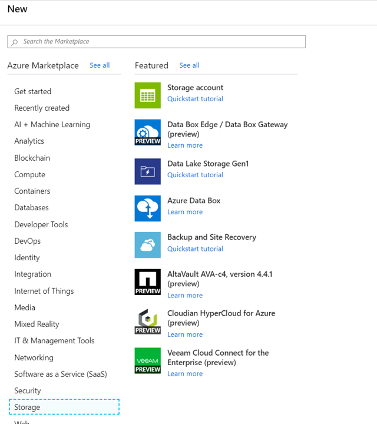

2. Fill all data like shown below
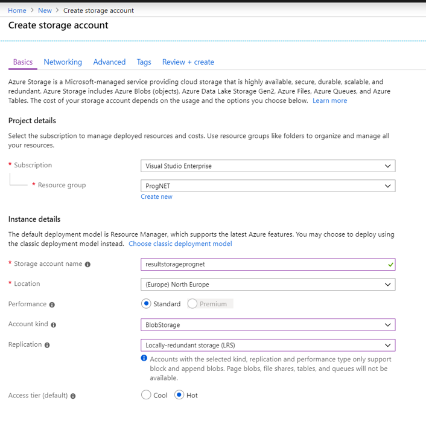

3. When validation is passed, go to create a storage
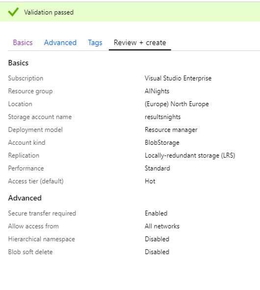

4. Go to Resource and click **Blob**
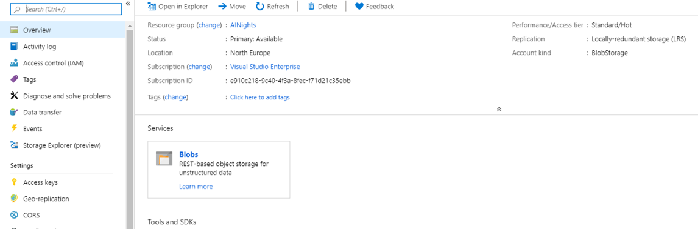

5. Create a new **Container** by adding name **image** and chose Public access level: Container (anonymous read access for containers and blobs)
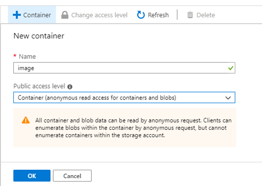

6. Create a new **Container** with the name **results**
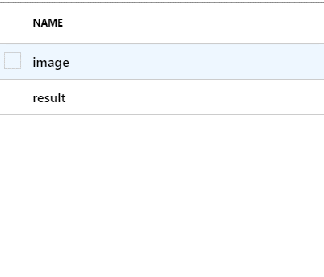

7. Before we starting create a logic apps, check that Microsoft Event Grid is Register. To do that go to your Subscription, select subscription you working on, click Resource Providers and find Microsoft Event Grid
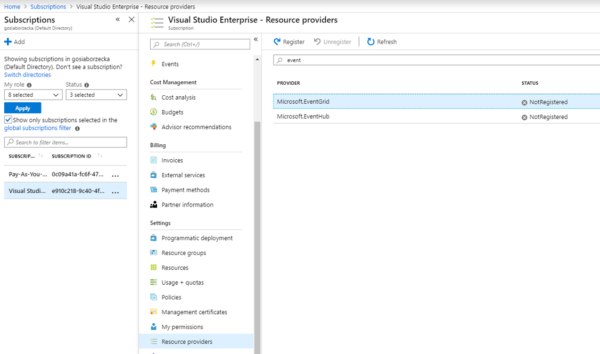

8. Click the Register button and wait few second that registration will finish
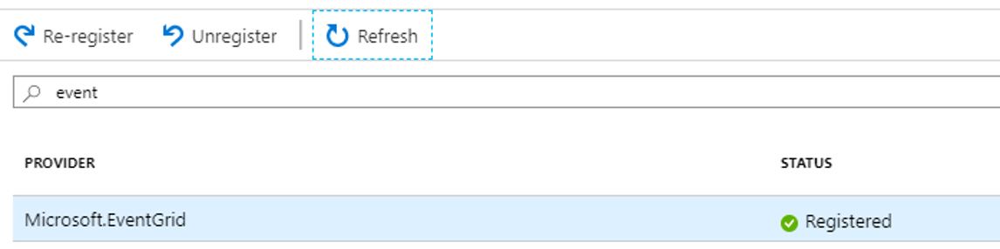

9. Time to create Logic Apps. Click Add New Resource and find LogicApp

10. Add the name, use the same resource that you use before for this exercice and click create
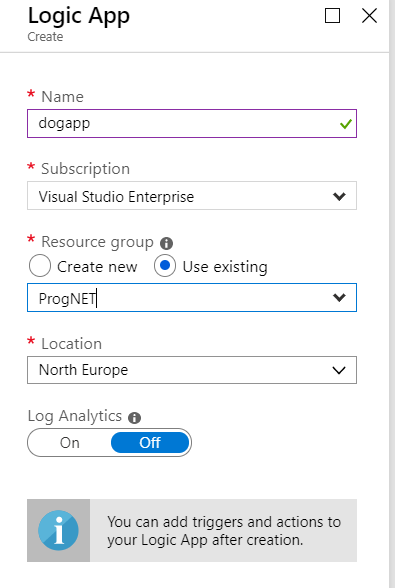
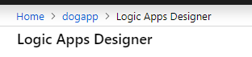

11. First we going to add first step **When the Event Grid resources event occurs**
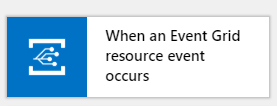

12. Sign in to your Azure tenant to use Event Grid
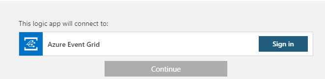
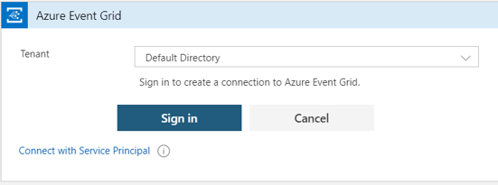
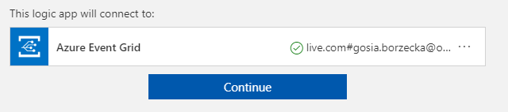

13. We want to check if on our blob will be added any image, to do that we need to fill the step as below
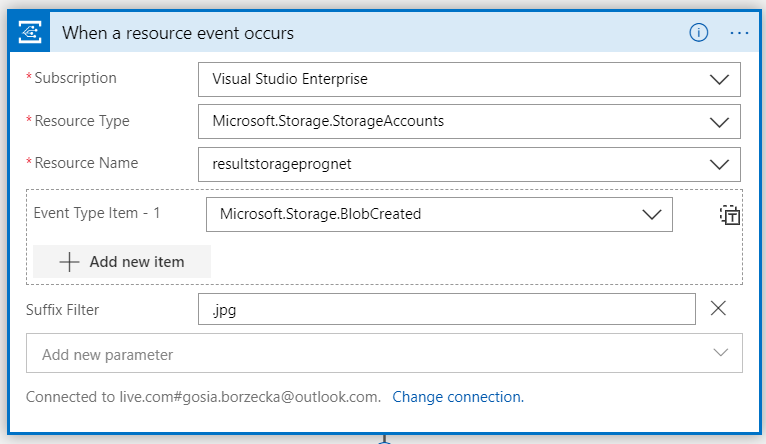

14. Next step is parse the json of the image that we will need to proceed
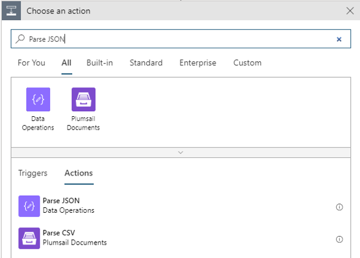

15. In Conent add Body (don't type, select the Body from dynamic content) and in schema copy the json from the [JSON file](https://github.com/gosiaborzecka/ProgNetWorkshop/blob/master/steps/04-CreateLogicApp/logic-app-schema1.json)
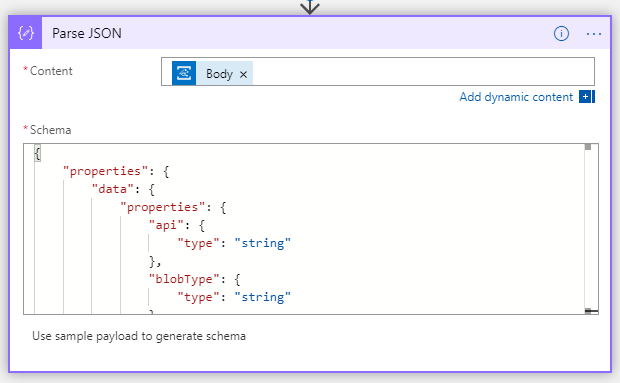

16. Next step is to connect to our Custom Vision app. Add new step and select Custom Vision
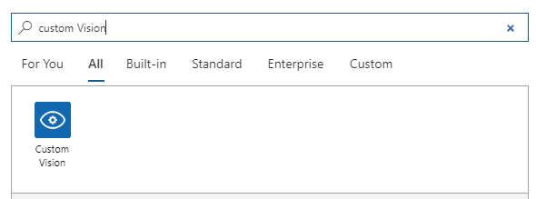

17. Selelct **Classify an image url (preview)**

18. Next we need to add Connection Name (custom) and Prediction Kety and Site URL from [CustomVision.ai website](http://customvision.ai)
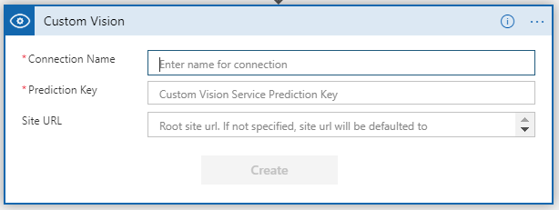

19. In Published app you have all information about prediction key and url (get only https://{localization}.api.cognitive.microsoft.com)
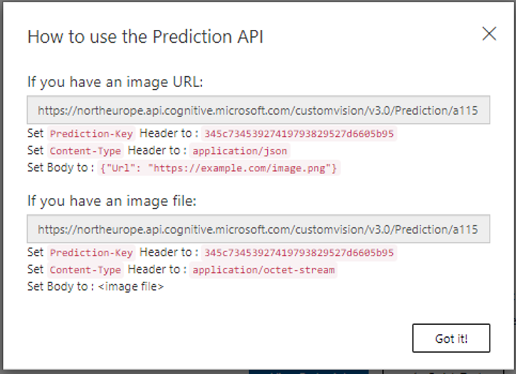

20. Now add custom connection name and Prediction Key and Site URL from the CustomVision.ai website
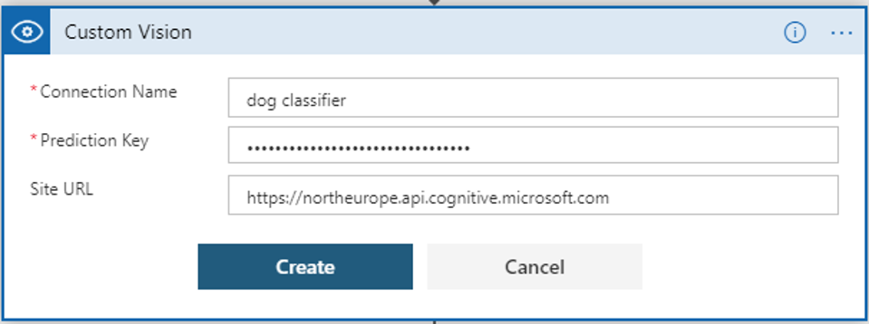

21. Next go back to  [CustomVision.ai](http://customvision.ai) and select Project settings, where you will find Project information (that we will use for next steps)
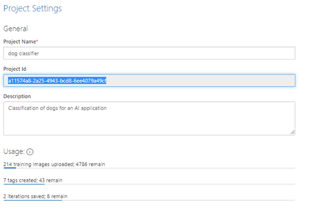

22. Update information from [CustomVision.ai](https://customvision.ai) by adding project ID and a name of your publishing name. Also select the dynamic content and select **url**
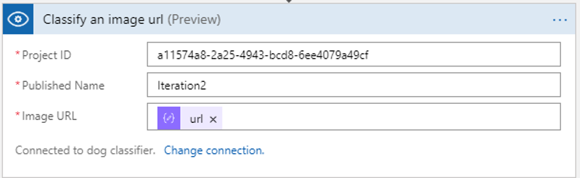

23. Next add new step **For Each**
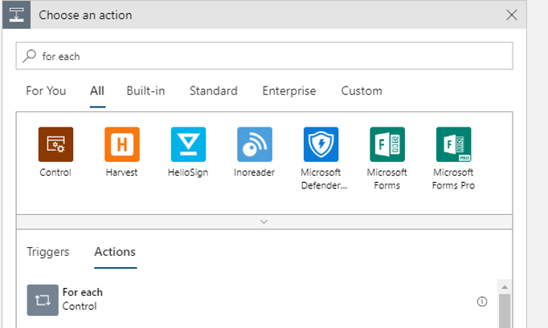

24. And select from dynamic content **Prediction**
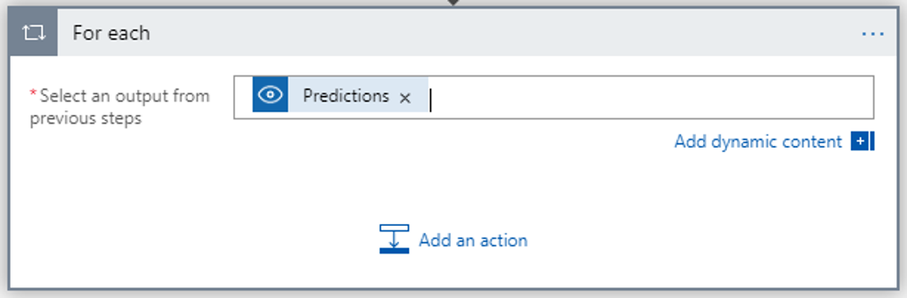

25. Select Next step **Control** and **Condition**
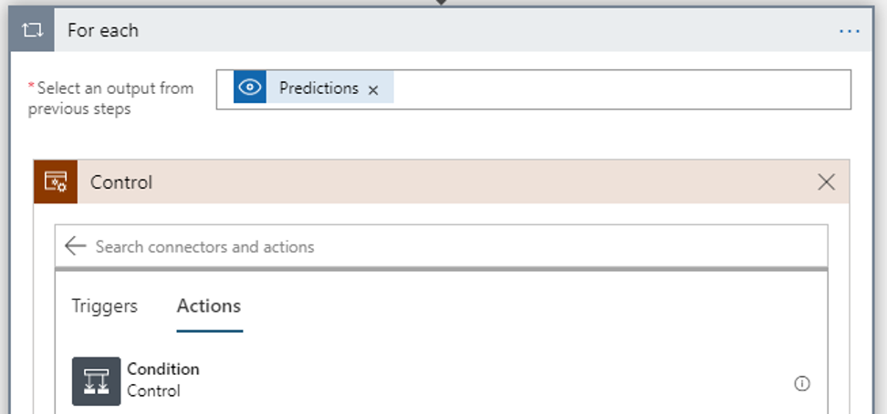

26. Inside select from dynamic conent **Prediction Probability** and select **is greater than** **0.7**
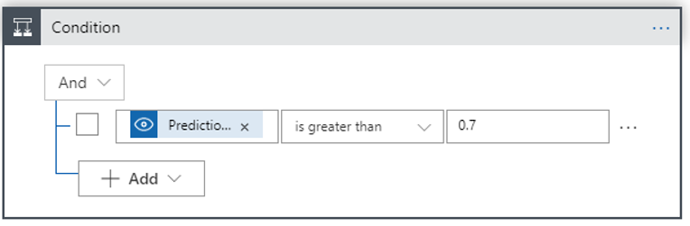

27. Add next step: **Azure Blob storage** and select **Create blob**
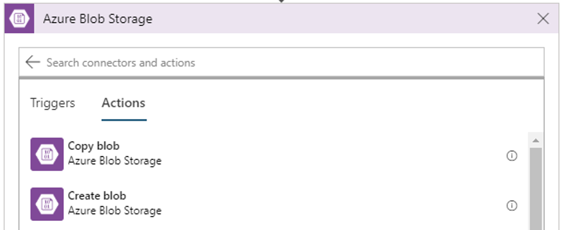

28. Select storage that was created at begining of this exercise
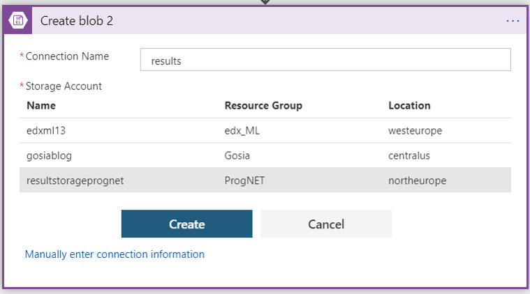

29. Select the folder **result** - there we will put the results that will back from **Custom Vision**
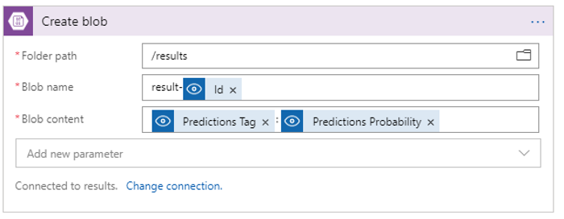

30. Save **Logic app** and go back to storage **image** and upload image from testset
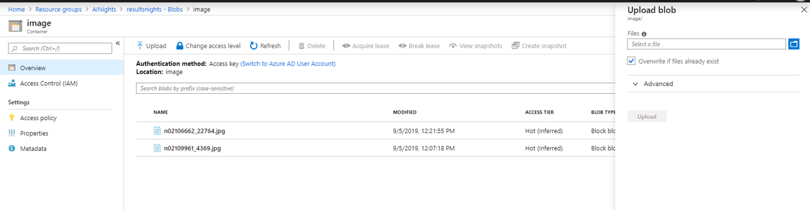

31. When you back again to **Logic App** tou will find the result and see exactly that the Logic App finished with Success
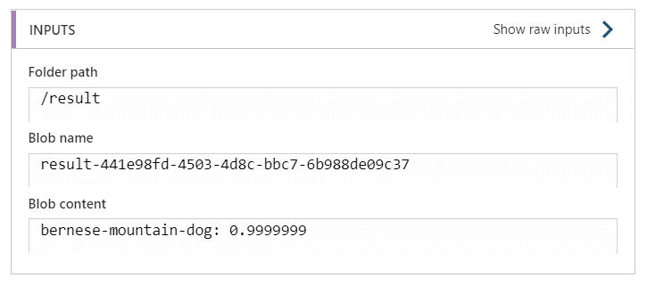

32. The same result you will find in the storage in the **result** container
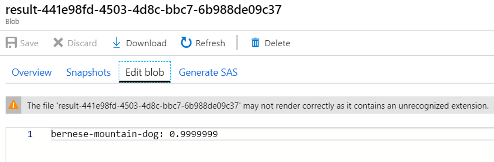